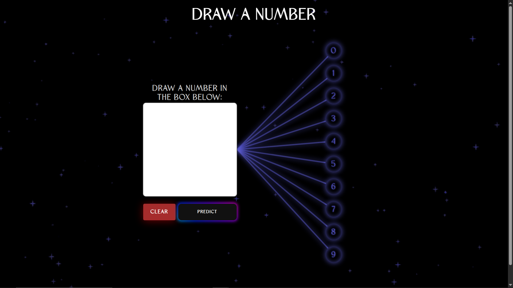
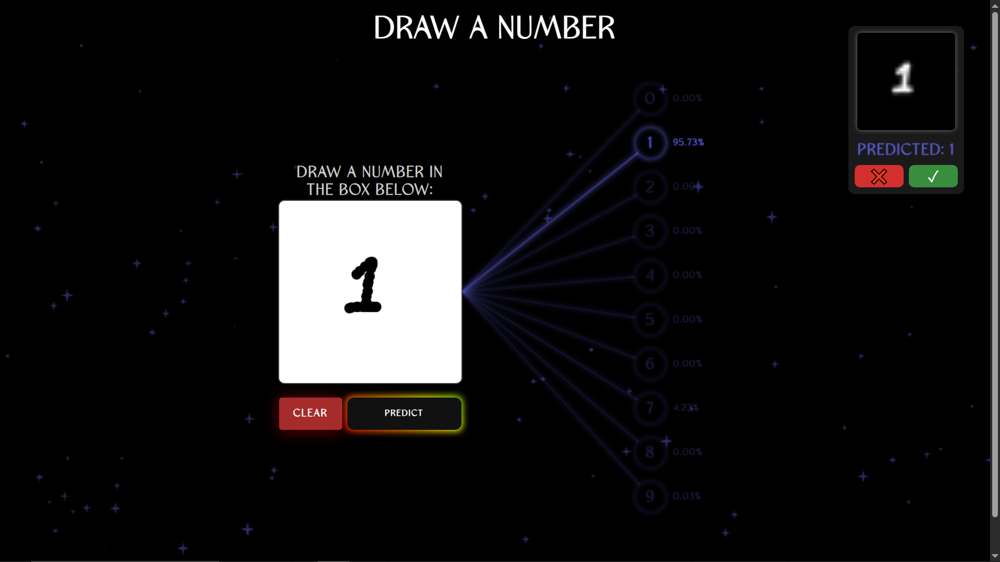
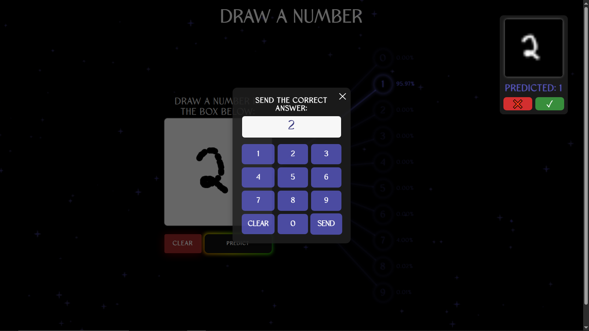

# 🔢 MNIST Drawing Classifier (Flask Web App)

This is a simple and interactive web application where you can **draw a digit (0–9)** using your mouse, and a **PyTorch-based neural network** will predict what digit you drew.

The model was trained on the **MNIST dataset** as well as additional **custom handwritten digit data** to improve real-world accuracy and generalization.


### NEW

##  Features

- Canvas for drawing digits
- Live prediction using a trained PyTorch model
- Visual display of class probabilities
- Backend powered by Flask
- Real-time input preview and prediction feedback
- [NEW ✅] added feedback system to learn different handwritings.
- [NEW ✅] **Docker support: Dockerfile pushed and ready to use**

---

##  Installation & Running the Project

You can run this project using **either a Python virtual environment** or **Docker**, depending on your setup and preference.

---

###  Option 1: Run Locally with Python Virtual Environment

#### 1. Clone the repository

```bash
git clone https://github.com/yourusername/mnist-drawing-classifier.git
cd mnist-drawing-classifier
````

#### 2. Create and activate a virtual environment

* **Windows:**

  ```bash
  python -m venv venv
  venv\Scripts\activate
  ```

* **macOS/Linux:**

  ```bash
  python3 -m venv venv
  source venv/bin/activate
  ```

#### 3. Install dependencies

```bash
pip install -r requirements.txt
```

#### 4. Run the Flask app

```bash
python app.py
```

Open your browser and go to:
📍 **[http://127.0.0.1:5000](http://127.0.0.1:5000)**

---

### 🐳 Option 2: Run with Docker

Make sure Docker is installed and running on your machine.

#### 1. Clone the repository

```bash
git clone https://github.com/yourusername/mnist-drawing-classifier.git
cd mnist-drawing-classifier
```

#### 2. Build the Docker image

```bash
docker build -t flask-app .
```

#### 3. Run the Docker container

```bash
docker run -p 5000:5000 flask-app
```

Open your browser and go to:
📍 **[http://127.0.0.1:5000](http://127.0.0.1:5000)**


> Choose the method that best fits your environment. Both options will give you access to the full functionality of the app.


---


##  Model Training

* The digit classification model is built with **PyTorch**.
* It was trained on:

  * The standard **MNIST dataset** (`60,000+` training examples)
  * Additional **custom handwritten digit data** to improve robustness and performance on real user input.

You can modify or retrain the model in the `train_model.py` (if provided) with your own dataset.

---

##  Project Structure

```
├── static/
│   ├── css/                    # Stylesheets
│   ├── js/                     # JavaScript files
│   └── received_input.png      # Image from canvas sent to the server
├── templates/
│   └── index.html              # Main UI template
├── app.py                      # Flask backend and model inference
├── model.pth                   # Trained PyTorch model
├── requirements.txt            # Python dependencies
└── README.md                   # Project documentation
```

---

##  Requirements

* Python 
* Flask
* Torch
* Torchvision
* Pillow

---

##  To Do / Future Work

* Deploy a flask hosting server

---